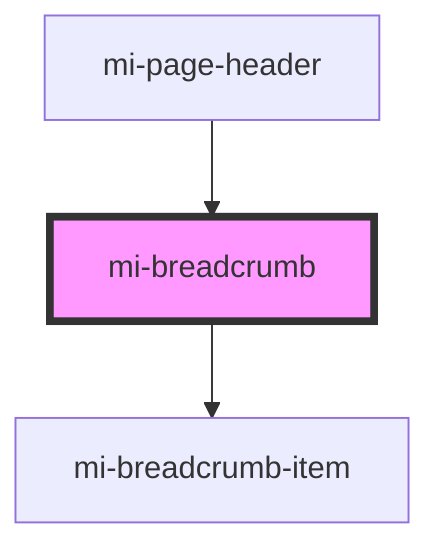

# mi-breadcrumb

<!-- Auto Generated Below -->

## Properties

| Property     | Attribute | Description       | Type                                                             | Default     |
| ------------ | --------- | ----------------- | ---------------------------------------------------------------- | ----------- |
| `params`     | --        | 路由的参数             | `Object`                                                         | `undefined` |
| `props`      | --        | 其他属性,如aria-无障碍属性等 | `{ [prop: string]: any; }`                                       | `undefined` |
| `renderItem` | --        | 根据路由信息，自定义面包屑每一项  | `(route: Route, params: Object, routes: Route[]) => HTMLElement` | `undefined` |
| `routes`     | --        | 路由栈信息             | `Route[]`                                                        | `[]`        |
| `separator`  | --        | 分隔符自定义            | `HTMLElement \| String`                                          | `'/'`       |

## Slots

| Slot | Description |
| ---- | ----------- |
|      | 默认内容插槽      |

## Dependencies

### Used by

 - [mi-page-header](../../PageHeader)

### Depends on

- [mi-breadcrumb-item](../BreadcrumbItem)

### Graph

----------------------------------------------

*Built with [StencilJS](https://stenciljs.com/)*
