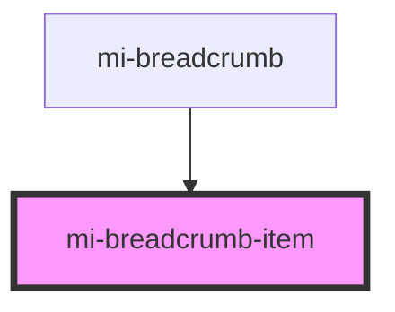

# mi-breadcrumb-item

<!-- Auto Generated Below -->

## Properties

| Property     | Attribute    | Description       | Type                       | Default     |
| ------------ | ------------ | ----------------- | -------------------------- | ----------- |
| `_separator` | `_separator` |                   | `string`                   | `undefined` |
| `href`       | `href`       | 链接的目的地            | `string`                   | `undefined` |
| `props`      | --           | 其他属性,如aria-无障碍属性等 | `{ [prop: string]: any; }` | `undefined` |

## Events

| Event     | Description | Type                 |
| --------- | ----------- | -------------------- |
| `onClick` |             | `CustomEvent<Route>` |

## Methods

### `handelClick() => Promise<void>`

#### Returns

Type: `Promise<void>`

## Slots

| Slot | Description |
| ---- | ----------- |
|      | 默认内容插槽      |

## Dependencies

### Used by

 - [mi-breadcrumb](../Breadcrumb)

### Graph

----------------------------------------------

*Built with [StencilJS](https://stenciljs.com/)*
