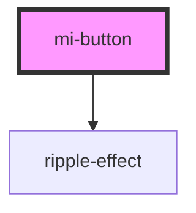

# mi-button

<!-- Auto Generated Below -->

## Properties

| Property   | Attribute   | Description                         | Type                                                                                                            | Default     |
| ---------- | ----------- | ----------------------------------- | --------------------------------------------------------------------------------------------------------------- | ----------- |
| `color`    | `color`     | 按钮颜色，可选值见 colors                    | `"danger" \| "dark" \| "light" \| "medium" \| "primary" \| "secondary" \| "success" \| "tertiary" \| "warning"` | `'primary'` |
| `disabled` | `disabled`  | 是否禁用按钮                              | `boolean`                                                                                                       | `false`     |
| `full`     | `full`      | 将按钮宽度调整为其父宽度                        | `boolean`                                                                                                       | `false`     |
| `href`     | `href`      | 点击跳转的地址，指定此属性 button 的行为和 a 链接一致    | `string`                                                                                                        | `undefined` |
| `htmlType` | `html-type` | 设置 button 原生的 type 值，可选值请参考 HTML 标准 | `string`                                                                                                        | `undefined` |
| `loading`  | `loading`   | 设置按钮载入状态                            | `boolean`                                                                                                       | `false`     |
| `props`    | --          | 其他属性,如aria-无障碍属性等                   | `{ [prop: string]: any; }`                                                                                      | `undefined` |
| `shape`    | `shape`     | 设置按钮形状                              | `"circle" \| "round"`                                                                                           | `undefined` |
| `size`     | `size`      | 设置按钮大小，可选值为 small large 或者不设        | `"large" \| "normal" \| "small"`                                                                                | `'normal'`  |
| `target`   | `target`    | a 链接的 target 属性，href 存在时生效          | `string`                                                                                                        | `undefined` |
| `variant`  | `variant`   | 按钮类型                                | `"dashed" \| "default" \| "fill" \| "ghost" \| "text"`                                                          | `'default'` |

## Slots

| Slot      | Description |
| --------- | ----------- |
|           | 默认内容插槽      |
| `"end"`   | 结束端内容插槽     |
| `"start"` | 开始端内容插槽     |

## CSS Custom Properties

| Name                     | Description                             |
| ------------------------ | --------------------------------------- |
| `--background`           | Background of the button                |
| `--background-activated` | Background of the button when activated |
| `--background-focused`   | Background of the button when focused   |
| `--background-hover`     | Background of the button on hover       |
| `--btn-radius`           | Border radius of the button             |
| `--btn-shadow`           | Box shadow of the button                |
| `--color`                | Text color of the button                |
| `--color-activated`      | Text color of the button when activated |
| `--color-focused`        | Text color of the button when focused   |
| `--color-hover`          | Text color of the button when hover     |
| `--font-weight`          | bold of the button text.html            |
| `--opacity`              | Opacity of the button                   |
| `--padding-bottom`       | Padding bottom of the button            |
| `--padding-end`          | Padding end of the button               |
| `--padding-start`        | Padding start of the button             |
| `--padding-top`          | Padding top of the button               |
| `--transition`           | Transition of the button                |

## Dependencies

### Depends on

- [ripple-effect](../ripple-effect)

### Graph

----------------------------------------------

*Built with [StencilJS](https://stenciljs.com/)*
