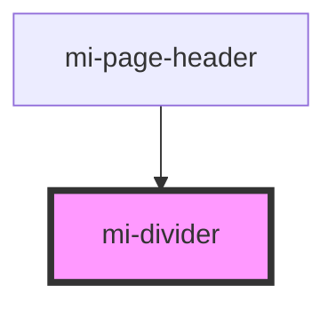

# mi-divider

<!-- Auto Generated Below -->

## Properties

| Property      | Attribute     | Description       | Type                            | Default        |
| ------------- | ------------- | ----------------- | ------------------------------- | -------------- |
| `classNames`  | --            | 分割线样式类            | `object`                        | `undefined`    |
| `dashed`      | `dashed`      | 是否虚线              | `boolean`                       | `false`        |
| `orientation` | `orientation` | 分割线标题的位置          | `"center" \| "left" \| "right"` | `undefined`    |
| `props`       | --            | 其他属性,如aria-无障碍属性等 | `{ [prop: string]: any; }`      | `undefined`    |
| `styles`      | --            | 分割线样式对象           | `object`                        | `undefined`    |
| `type`        | `type`        | 水平还是垂直类型          | `"horizontal" \| "vertical"`    | `'horizontal'` |

## CSS Custom Properties

| Name           | Description               |
| -------------- | ------------------------- |
| `--background` | Background of the divider |
| `--stroke`     | stroke of divider         |

## Dependencies

### Used by

 - [mi-page-header](../PageHeader)

### Graph

----------------------------------------------

*Built with [StencilJS](https://stenciljs.com/)*
