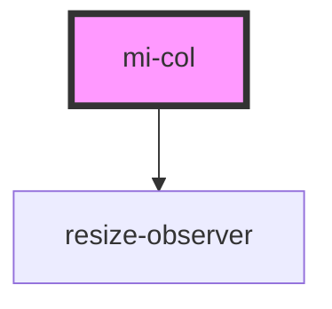

# mi-col

<!-- Auto Generated Below -->

## Properties

| Property   | Attribute | Description                   | Type                                                                                                                                                                                                                                                                                                   | Default     |
| ---------- | --------- | ----------------------------- | ------------------------------------------------------------------------------------------------------------------------------------------------------------------------------------------------------------------------------------------------------------------------------------------------------ | ----------- |
| `offset`   | `offset`  | 栅格左侧的间隔格数，间隔内不可以有栅格           | `number`                                                                                                                                                                                                                                                                                               | `0`         |
| `order`    | `order`   | 栅格顺序，flex 布局模式下有效             | `string`                                                                                                                                                                                                                                                                                               | `undefined` |
| `props`    | --        | 其他属性,如aria-无障碍属性等             | `{ [prop: string]: any; }`                                                                                                                                                                                                                                                                             | `undefined` |
| `pull`     | `pull`    | 栅格向左移动格数                      | `number`                                                                                                                                                                                                                                                                                               | `0`         |
| `push`     | `push`    | 栅格向右移动格数                      | `number`                                                                                                                                                                                                                                                                                               | `0`         |
| `response` | --        | 响应式栅格，可为栅格数或一个包含其他属性的对象       | `{ xs?: Partial<Record<ColAttrsCategory, number>>; sm?: Partial<Record<ColAttrsCategory, number>>; md?: Partial<Record<ColAttrsCategory, number>>; lg?: Partial<Record<ColAttrsCategory, number>>; xl?: Partial<Record<ColAttrsCategory, number>>; xxl?: Partial<Record<ColAttrsCategory, number>>; }` | `undefined` |
| `span`     | `span`    | 栅格占位格数，为 0 时相当于 display: none | `number`                                                                                                                                                                                                                                                                                               | `undefined` |

## Methods

### `getAttrs() => Promise<void>`

#### Returns

Type: `Promise<void>`

### `resize() => Promise<void>`

#### Returns

Type: `Promise<void>`

## Dependencies

### Depends on

- [resize-observer](../../resize-observer)

### Graph

----------------------------------------------

*Built with [StencilJS](https://stenciljs.com/)*
