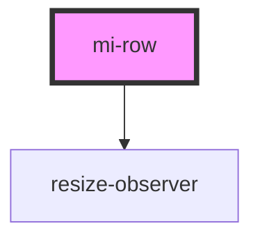

# mi-row

<!-- Auto Generated Below -->

## Properties

| Property | Attribute | Description                                      | Type                                                                                           | Default     |
| -------- | --------- | ------------------------------------------------ | ---------------------------------------------------------------------------------------------- | ----------- |
| `gutter` | `gutter`  | 栅格间隔，可以写成像素值或支持响应式的对象写法 { xs: 8, sm: 16, md: 24} | `number \| { xs?: number; sm?: number; md?: number; lg?: number; xl?: number; xxl?: number; }` | `8`         |
| `props`  | --        | 其他属性,如aria-无障碍属性等                                | `{ [prop: string]: any; }`                                                                     | `undefined` |

## Methods

### `getGutter() => Promise<void>`

#### Returns

Type: `Promise<void>`

### `renderChildNode() => Promise<void>`

#### Returns

Type: `Promise<void>`

### `resize() => Promise<void>`

#### Returns

Type: `Promise<void>`

## Dependencies

### Depends on

- [resize-observer](../../resize-observer)

### Graph

----------------------------------------------

*Built with [StencilJS](https://stenciljs.com/)*
