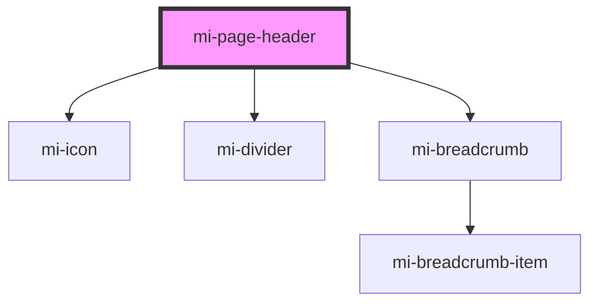

# mi-page-header

<!-- Auto Generated Below -->

## Properties

| Property     | Attribute   | Description       | Type                       | Default        |
| ------------ | ----------- | ----------------- | -------------------------- | -------------- |
| `backIcon`   | `back-icon` | 自定义 back icon'    | `string`                   | `'arrow_back'` |
| `breadcrumb` | --          | 面包屑的配置            | `Route[]`                  | `undefined`    |
| `onBack`     | --          | 返回按钮的点击事件         | `() => void`               | `()=>{}`       |
| `props`      | --          | 其他属性,如aria-无障碍属性等 | `{ [prop: string]: any; }` | `undefined`    |
| `subTitle`   | `sub-title` | 自定义的二级标题文字        | `string`                   | `undefined`    |
| `titles`     | `titles`    | 自定义标题文字           | `string`                   | `undefined`    |

## Slots

| Slot        | Description       |
| ----------- | ----------------- |
| `"default"` | 默认的内容             |
| `"end"`     | 操作区，位于 title 行的行尾 |
| `"tags"`    | title 旁的 tag 列表插槽 |

## Dependencies

### Depends on

- [mi-icon](../Icon)
- [mi-divider](../Divider)
- [mi-breadcrumb](../Breadcrumb/Breadcrumb)

### Graph

----------------------------------------------

*Built with [StencilJS](https://stenciljs.com/)*
