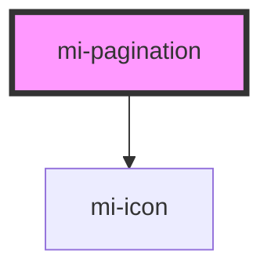

# mi-pagination

<!-- Auto Generated Below -->

## Properties

| Property           | Attribute             | Description             | Type                       | Default                              |
| ------------------ | --------------------- | ----------------------- | -------------------------- | ------------------------------------ |
| `change`           | --                    | 页码改变的回调，参数是改变后的页码及每页条数  | `Function`                 | `() => {   }`                        |
| `current`          | `current`             | 当前页数                    | `number`                   | `undefined`                          |
| `defaultCurrent`   | `default-current`     | 默认当前页数                  | `number`                   | `1`                                  |
| `defaultPageSize`  | `default-page-size`   | 默认的每页条数                 | `number`                   | `10`                                 |
| `disabled`         | `disabled`            | 禁用分页                    | `boolean`                  | `false`                              |
| `hideOnSinglePage` | `hide-on-single-page` | 只有一页时是否隐藏分页器            | `boolean`                  | `false`                              |
| `layout`           | `layout`              | 组件布局，子组件名用逗号分隔          | `string`                   | `'prev, pager, next, jumper, total'` |
| `pageSize`         | `page-size`           | 每页条数                    | `number`                   | `undefined`                          |
| `pageSizeOptions`  | --                    | 指定每页可以显示多少条             | `number[]`                 | `undefined`                          |
| `props`            | --                    | 其他属性,如aria-无障碍属性等       | `{ [prop: string]: any; }` | `undefined`                          |
| `renderItem`       | --                    | 用于自定义页码的结构              | `Function`                 | `undefined`                          |
| `simple`           | `simple`              | 当添加该属性时，显示为简单分页         | `boolean`                  | `false`                              |
| `size`             | `size`                | size  当为「small」时，是小尺寸分页 | `string`                   | `''`                                 |
| `skipNum`          | `skip-num`            | 快速跳转的页数                 | `number`                   | `5`                                  |
| `total`            | `total`               | 数据总数                    | `number`                   | `undefined`                          |

## CSS Custom Properties

| Name                 | Description  |
| -------------------- | ------------ |
| `--background-color` | 分页每一项背景颜色    |
| `--border-color`     | 分页每一项边框颜色    |
| `--border-radius`    | 分页每一项圆角大小    |
| `--color-actived`    | actived上去的颜色 |
| `--color-hover`      | hover上去的颜色   |
| `--height`           | 分页每一项高度      |
| `--margin-right`     | 分页每一项间隔      |
| `--width`            | 分页每一项最小宽度    |

## Dependencies

### Depends on

- [mi-icon](../Icon)

### Graph

----------------------------------------------

*Built with [StencilJS](https://stenciljs.com/)*
