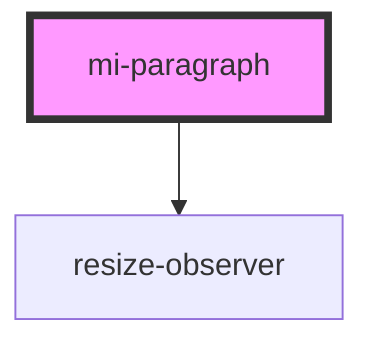

# mi-paragraph

<!-- Auto Generated Below -->

## Properties

| Property   | Attribute  | Description       | Type                       | Default     |
| ---------- | ---------- | ----------------- | -------------------------- | ----------- |
| `ellipsis` | `ellipsis` | 自动溢出省略            | `Ellipsis \| boolean`      | `undefined` |
| `props`    | --         | 其他属性,如aria-无障碍属性等 | `{ [prop: string]: any; }` | `undefined` |

## Methods

### `toggleExpand() => Promise<void>`

#### Returns

Type: `Promise<void>`

## CSS Custom Properties

| Name      | Description                  |
| --------- | ---------------------------- |
| `--color` | Text color of the typography |

## Dependencies

### Depends on

- [resize-observer](../../resize-observer)

### Graph

----------------------------------------------

*Built with [StencilJS](https://stenciljs.com/)*
