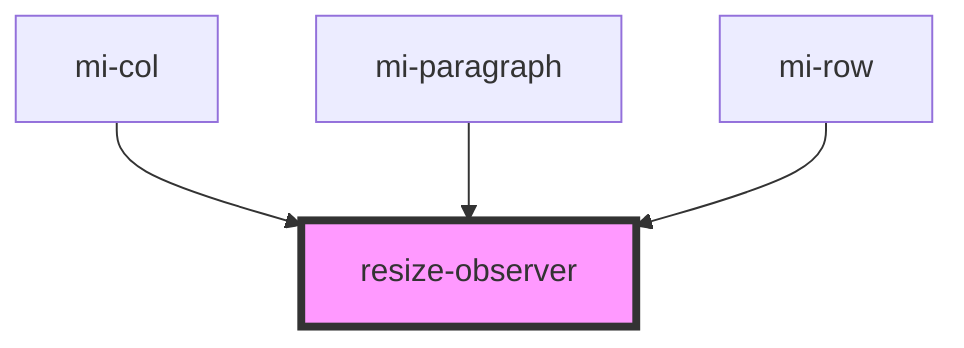

# resize-observer


<!-- Auto Generated Below -->


## Usage

### Javascript

```html
<resize-observer id="ro">
  <div style="width: 100%;height: 500px;background-color: greenyellow">
    0
  </div>
</resize-observer>
```
```
 var tag =document.getElementById('ro');
  tag.onResize=function () {
    tag.querySelector('div').innerHTML +=2222;
  }
  
```


## Properties

| Property   | Attribute  | Description | Type       | Default     |
| ---------- | ---------- | ----------- | ---------- | ----------- |
| `disabled` | `disabled` | 是否禁用        | `boolean`  | `false`     |
| `resize`   | --         | 重新计算元素宽高的回调 | `Function` | `undefined` |


## Dependencies

### Used by

 - [mi-col](../Grid/Col)
 - [mi-paragraph](../Typography/Paragraph)
 - [mi-row](../Grid/Row)

### Graph


----------------------------------------------

*Built with [StencilJS](https://stenciljs.com/)*
