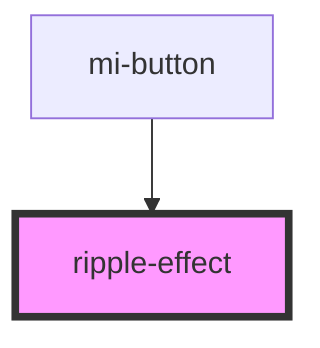

# ripple-effect

The ripple effect component adds the [Material Design ink ripple interaction effect](https://material.io/develop/web/components/ripples/). This component can be used without a button and can be added to any component.


<!-- Auto Generated Below -->


## Usage

### Javascript

```html
<div>
  <ripple-effect></ripple-effect>
  A plain div with a ripple effect
</div>

<button>
  <ripple-effect></ripple-effect>
  Button
</button>
```


## Properties

| Property | Attribute | Description                                                                                                                                                                                                                                                                                                                                                         | Type                       | Default     |
| -------- | --------- | ------------------------------------------------------------------------------------------------------------------------------------------------------------------------------------------------------------------------------------------------------------------------------------------------------------------------------------------------------------------- | -------------------------- | ----------- |
| `type`   | `type`    | Sets the type of ripple-effect:  - `bounded`: the ripple effect expands from the user's click position - `unbounded`: the ripple effect expands from the center of the button and overflows the container.  NOTE: Surfaces for bounded ripples should have the overflow property set to hidden, while surfaces for unbounded ripples should have it set to visible. | `"bounded" \| "unbounded"` | `'bounded'` |


## Methods

### `addRipple(x: number, y: number) => Promise<() => void>`

Adds the ripple effect to the parent element.

#### Returns

Type: `Promise<() => void>`


## Dependencies

### Used by

 - [mi-button](../Button)

### Graph


----------------------------------------------

*Built with [StencilJS](https://stenciljs.com/)*
